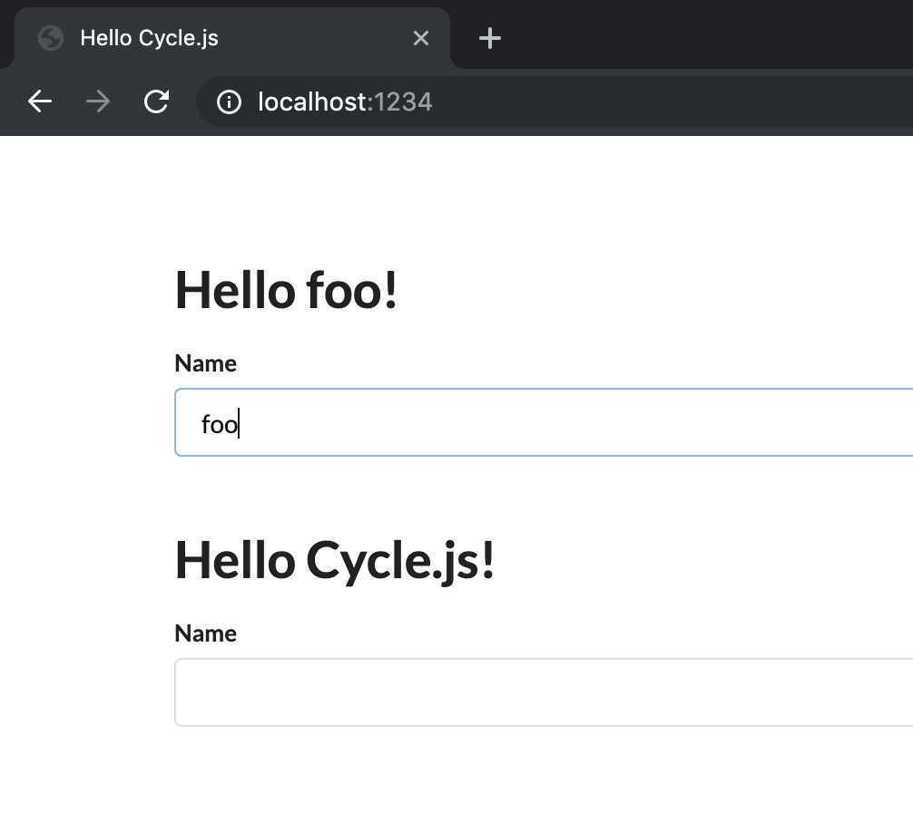

# Hello World Cycle.js

Cycle.js の学習記録。  
基本動作＋コンポーネントを使ってみるくらいのレベル。  
ドライバーは DOM のみ、API 通信はなし。

## Getting started

```bash
yarn
yarn start
# Open http://localhost:1234
```



## メモ

- Parcel を使っているのは、TypeScript がすぐ使えてセットアップが簡単だから
- RxJS ではなく xstream を使っているのは、公式推奨なのと触ったことがなかったから
  - RxJS と `map()` や `combine()` の書き方が違う
  - `Observable` ではなく `Stream` を使うっぽい
- CSS フレームワークに Semantic UI を使っているのは、触ったことがなかったから
  - 今回の学習においては重要ではない
- TypeScript 3.5 なのは、3.6 だと `DOM.select(".foo").events("input")` のところで型エラーが出るから
  - `events` はプロパティであって callable ではないと言われる・・・型定義は callable に見えるのに
- `@cycle/isolate` を使っていないのは、`isolate()` を使う意味を理解するためにあえて
  - なんで複数インスタンス使うときに isolate しないといけないのか、自前で頑張ってみることで理解できた
  - コンポーネントに渡ってくる `DOMSource` のスコープが広すぎ（`#app` 以下の要素を全部参照できるっぽい？）て、複数ある `input` 要素の全イベントをストリームとして拾ってしまう、のが isolate しないと挙動が変になる理由（と思う）
  - `HelloInput` コンポーネント内でユニークなクラス名をつけてコンポーネントを独立させるという書き方にしたが、そもそもコンポーネントに渡す `DOMSource` を `select()` によって絞ってあげるのでもよい。  
    むしろそちらの方が綺麗かも

## References

- [Cycle.js - Getting started](https://cycle.js.org/getting-started.html)
- wakamsha's articles on PSYENCE:MEDIA
  - [リアクティブ・プログラミングに特化した JS フレームワーク Cycle.js を学ぼう #1 – 導入編 – PSYENCE:MEDIA](https://tech.recruit-mp.co.jp/front-end/post-11898/)
  - [JSX、TemplateLiteral とは一味違うテンプレートエンジン HyperScript – Cycle.js を学ぼう #2 – PSYENCE:MEDIA](https://tech.recruit-mp.co.jp/front-end/post-11940/)
  - [【超絶シンプル設計】Cycle.js でコンポーネントを作ってみる – Cycle.js を学ぼう #3 – PSYENCE:MEDIA](https://tech.recruit-mp.co.jp/front-end/post-11974/)
